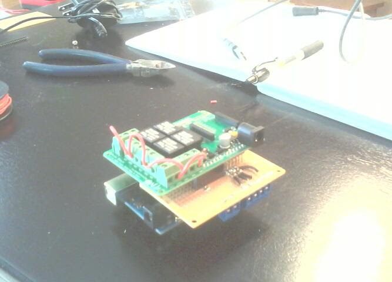

# Interface between an Ecobee smart thermostat and an RV 12V AC system.

I put this here just so I wouldn't lose it - the RV it was designed for was traded-in and the older Ecobee's went with it.  It was an interesting project that was extremely useful. It was also the first Arduino project I'd ever done, and probably the most advanced electronics I'd build since I was a kid.

I never finished adding the furnace system to the project, but that looked like it was going to be pretty much the same as the AC interface.

