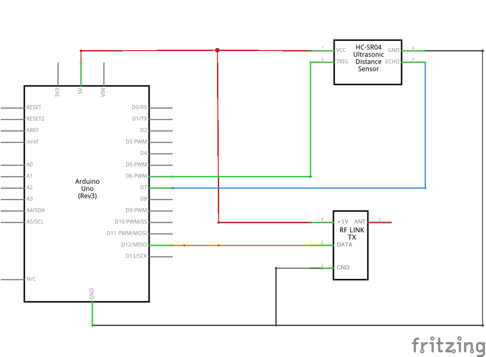

# Ultrasonic rangerfinder w/ RF transmitter 

This project uses a HC-SR04 ultrasonic distance sensor as the rangefinder and transmits the result via a 433MHz RF link to the paired receiver. 
 
## Parts
<table>
  <thead>
	<tr>
    <th>Count</th>
    <th>Part Type</th>
    </tr>
  </thead>
  <tbody>
<tr>
    <td>1</td>
    <td>HC-SR04 Ultrasonic Distance Sensor</td>
</tr><tr>
    <td>1</td>
    <td>Arduino Uno (Rev3)</td>
</tr><tr>
    <td>1</td>
    <td>433MHz RF Link Transmitter</td>
</tr>
  </tbody>
</table>

