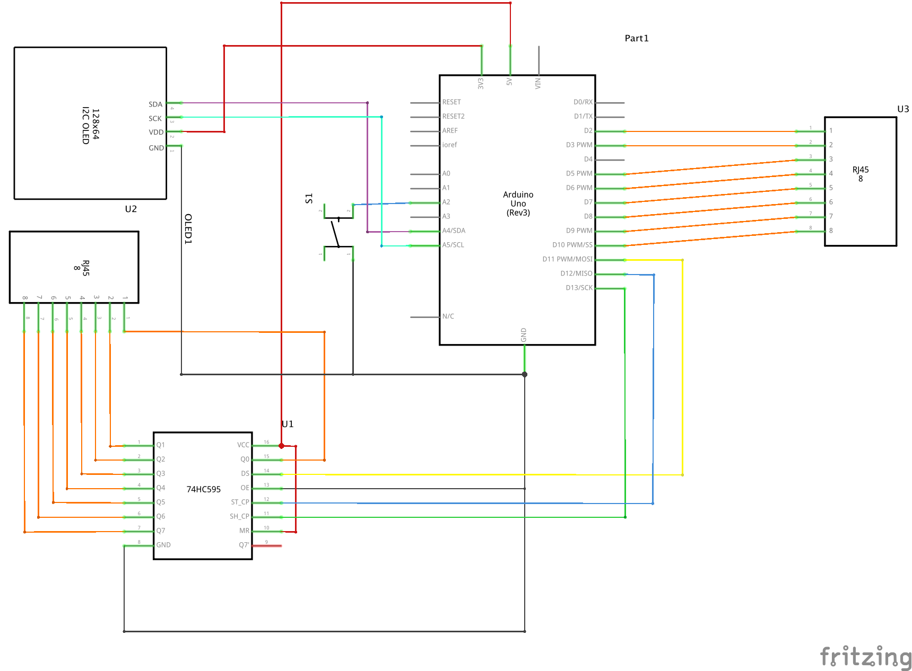

# Ethernet Cable Tester

This project is a simple Ethernet cable tester using a 74HC595.  Basic concept is:
1. Send signal (i.e. voltage) through one pin on RJ45 connector "A"
2. Check each pin on RJ45 connecter "B" for signal
3. Repeat for all pins on connector "A".

## Quick Note about different boards
The older Micro I tried has different pinouts for the SSD_1306.  It uses D2 and D3 instead of A4 and A5.

## Parts 
<table>
  <thead>
	<tr>
    <th>Count</th>
    <th>Part Type</th>
    </tr>
  </thead>
  <tbody>
<tr>
    <td>1</td>
    <td>OLED 128x64 I2C Monochrome Display</td>
</tr><tr>
    <td>1</td>
    <td>Arduino Uno (Rev3)</td>
</tr><tr>
    <td>1</td>
    <td>Pushbutton</td>
</tr><tr>
    <td>1</td>
    <td>74HC595</td>
</tr><tr>
    <td>2</td>
    <td>RJ45 Jack</td>
</tr>
  </tbody>
</table>

## Schematic

